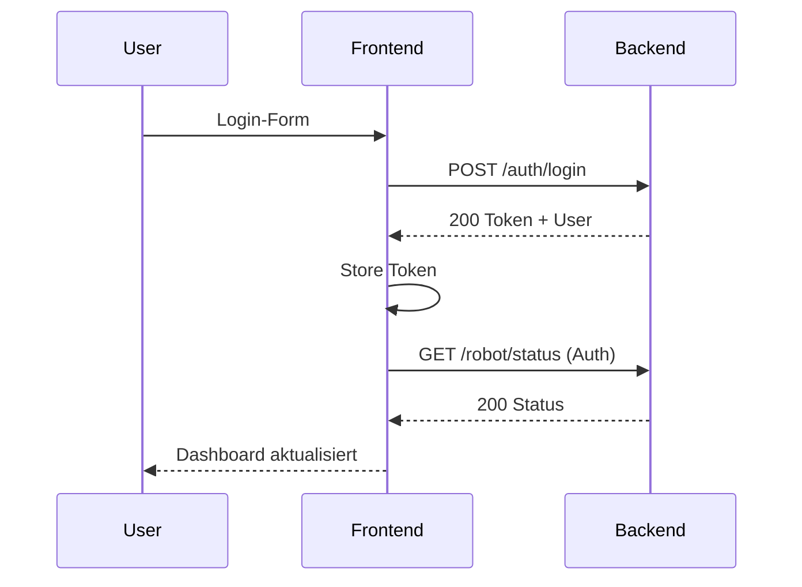

# Frontend-Backend-Kommunikation (Planung)

## Ziel
Dokumentation der geplanten Kommunikation zwischen Frontend und Backend, bevor die Implementierung erfolgt. Fokus auf Endpunkte, Auth-Strategie, Datenflüsse und Fehlerbehandlung.

## Architektur (Planung)
- Frontend: React SPA
- Backend: REST API
- Kommunikation via JSON over HTTPS
- Authentifizierung via Token (z. B. JWT)
- Zentraler API-Layer im Frontend

## API-Schicht im Frontend (Planung)
- Datei: services/api.js
- Aufgaben:
  - Basis-URL
  - Request-Wrapper (fetch/axios)
  - Token-Handling
  - Standardisierte Fehlerbehandlung

## Auth-Flow (Planung)
1. Benutzer meldet sich an (Login-Form)
2. Frontend sendet Credentials an /auth/login
3. Backend liefert Token + User-Info
4. Token wird gespeichert (Memory/Storage)
5. Token wird bei jedem Request im Header mitgesendet

### Headers (Planung)
- Authorization: Bearer <token>
- Content-Type: application/json

## Geplante Endpunkte (hohes Niveau)

### Auth
- POST /auth/login
- POST /auth/register
- GET /auth/me

### Diary
- GET /diary
- POST /diary
- PUT /diary/:id
- DELETE /diary/:id
- GET /diary/public

### Robot/Queue
- GET /robot/status
- POST /robot/action
- GET /queue
- POST /queue
- DELETE /queue/:id

### Admin
- GET /admin/users
- PUT /admin/users/:id/role

## Datenmodelle (Planung)

### User
```json
{
  "id": "string",
  "name": "string",
  "email": "string",
  "role": "admin|user"
}
```

### DiaryEntry
```json
{
  "id": "string",
  "title": "string",
  "content": "string",
  "public": true,
  "createdAt": "ISO-8601"
}
```

### RobotStatus
```json
{
  "state": "idle|running|error",
  "queueLength": 0,
  "lastUpdate": "ISO-8601"
}
```

## Fehlerbehandlung (Planung)
- Einheitliches Fehlerformat vom Backend:
```json
{
  "error": "string",
  "code": "string",
  "message": "string"
}
```
- Frontend zeigt Toast/Alert an
- Bei 401: Logout & Redirect zu Login

## Caching & Revalidation (Planung)
- Kurze Polling-Intervalle für Robot-Status
- Keine aggressive Cache-Strategie
- Optional: ETag/If-None-Match

## Sicherheitsaspekte (Planung)
- HTTPS-only
- Token nicht in URLs
- Minimal Scope pro Rolle
- CSRF-Strategie falls Cookies genutzt werden

## Sequenzdiagramm (Planung)



## ToDos (Planung)
- Endpunktliste finalisieren
- Fehlercodes standardisieren
- Rollenmatrix definieren
- Logging/Tracing festlegen