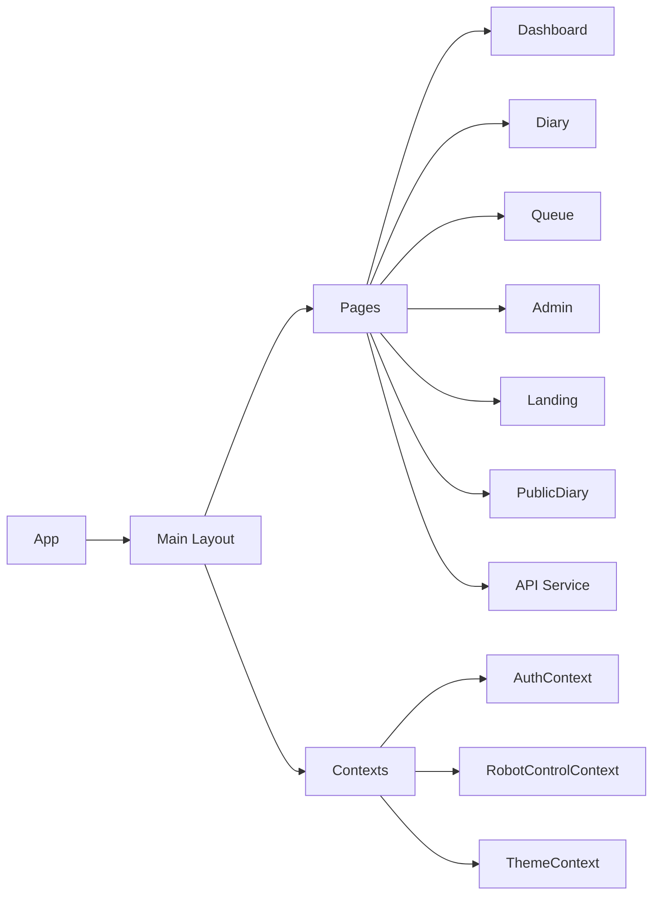

# Webseitenplanung (Stand: vor Umsetzung)

## Ziel
Eine moderne, klare Weboberfläche. Fokus auf schnelle Orientierung, sichere Authentifizierung, Robotik-Steuerung und Tagebuch.

## Zielgruppe
- Betreiber:innen des Systems
- Administrator:innen
- Nutzer:innen mit Zugriff auf Roboter- und Tagebuchfunktionen
- Öffentliche Besucher:innen (öffentliche Inhalte)

## Informationsarchitektur (Sitemap)
- Landing
  - Kurze Produktbeschreibung
  - Primärer Call-to-Action (Login/Register)
- Dashboard (authentifiziert)
  - Überblick Robotik-Status
  - Schnellaktionen
  - KPIs/Statuskarten
- Diary (authentifiziert)
  - Einträge auflisten
  - Eintrag erstellen/bearbeiten
- Public Diary (öffentlich)
  - Lesemodus für freigegebene Einträge
- Queue Control (authentifiziert, ggf. role-basiert)
  - Warteschlange sehen
  - Aktionen (start/stop/flush)
- Admin Panel (authentifiziert, role-basiert)
  - Nutzerverwaltung
  - Rollen/Permissions
- About
- Contact
- Legal
- Privacy
- Terms
- Login
- Register

## Rollen & Rechte (Planung)
- Visitor (öffentlich)
  - Landing, About, Contact, Legal, Privacy, Terms, Public Diary
- User (authentifiziert)
  - Dashboard, Diary, Queue Control (je nach Rolle)
- Admin
  - Admin Panel, erweiterte Queue-Steuerung, Nutzerverwaltung

## Layout & Komponenten (Planung)
- Globales Layout
  - Top-Navigation mit Logo, Hauptlinks, Auth-Status
  - Footer mit Legal/Privacy/Terms
- Wiederverwendbare Komponenten
  - Buttons (Primary/Secondary/Danger)
  - Cards (Status, KPI, Diary)
  - Tables/Lists (Queue, Admin)
  - Modals/Dialogs (Delete/Confirm)
  - Forms (Login/Register/Diary)
  - Toasts/Alerts (Errors/Success)
- Zustandsverwaltung
  - AuthContext (User/Token/Role)
  - RobotControlContext (Queue/Robot Actions)
  - ThemeContext (Light/Dark)

## Seitenplanung (Detail)
### Landing
- Hero mit Value Proposition
- CTA: Login/Register
- Abschnitt mit Funktions-Highlights
- Screenshot/Illustration

### Dashboard
- Statuskarten (Robot, Queue, System)
- Schnellaktionen (Start/Stop/Reset)
- Letzte Diary-Events

### Diary
- Liste der Einträge
- Filter/Sortierung
- Editor (Titel, Inhalt)

### Public Diary
- Öffentliche Einträge
- Read-only

### Queue Control
- Warteschlange sichtbar
- Aktionen: hinzufügen/entfernen/pausieren
- Rollenabhängig

### Admin Panel
- Nutzerliste
- Rollen ändern
- Admin-Aktionen

### Auth (Login/Register)
- Formulare mit Validation
- Fehlermeldungen
- Redirect nach Login

### Rechtliche Seiten
- Legal/Privacy/Terms als statische Seiten

## Datenobjekte (Planung)
- User
  - id, name, email, role
- DiaryEntry
  - id, title, content, createdAt, public
- RobotStatus
  - state, queueLength, lastUpdate
- QueueItem
  - id, type, status

## Nichtfunktionale Anforderungen
- Responsives Layout (mobile/desktop)
- Barrierearme Kontraste
- Schnelle Ladezeiten
- Einheitlicher UI-Stil (Tailwind)
- Konsistente Fehlerbehandlung

## UML (vereinfachtes Komponenten- & Zustandsmodell)

## Meilensteine (Planung)
1. IA/Sitemap finalisieren
2. UI Wireframes
3. Routing & Layout
4. Auth Flow
5. Dashboard/Diary/Queue
6. Admin Panel
7. Öffentliche Seiten
8. Testing & Polish
