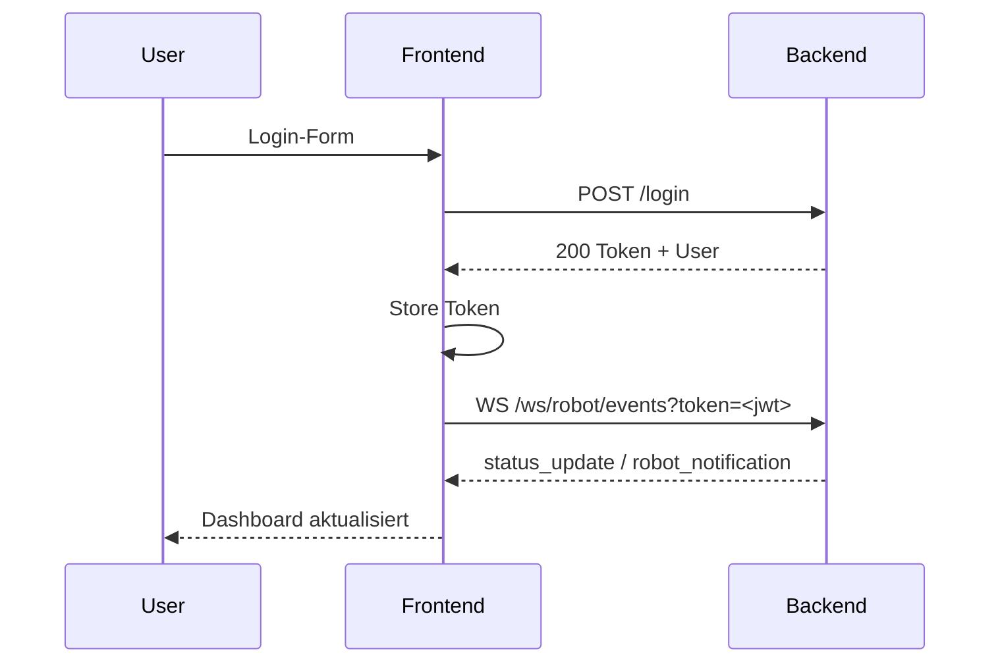

# Frontend-Backend-Kommunikation

## Ziel
Dokumentation der geplanten Kommunikation zwischen Frontend und Backend, bevor die Implementierung erfolgt. Fokus auf Endpunkte, Auth-Strategie, Datenflüsse und Fehlerbehandlung.

## Architektur
- Frontend: React SPA
- Backend: REST API
- Kommunikation via JSON over HTTPS
- Authentifizierung via Token (z. B. JWT)
- Zentraler API-Layer im Frontend

## API-Schicht im Frontend
- Datei: services/api.js
- Aufgaben:
  - Basis-URL
  - Request-Wrapper (fetch/axios)
  - Token-Handling
  - Standardisierte Fehlerbehandlung

## Auth-Flow
1. Benutzer meldet sich an (Login-Form)
2. Frontend sendet Credentials an /login
3. Backend liefert Token + User-Info
4. Token wird gespeichert (Memory/Storage)
5. Token wird bei jedem Request im Header mitgesendet

### Headers
- Authorization: Bearer <token>
- Content-Type: application/json

## Geplante Endpunkte (hohes Niveau)

### Auth
- POST /login
- POST /register
- GET /me

### Diary
- GET /diary
- POST /diary
- PUT /diary/:id
- DELETE /diary/:id
- GET /diary/public

### Robot/Queue
- GET /nodes
- GET /routes
- POST /routes
- DELETE /routes/:id
- POST /routes/select
- POST /drive/lock
- DELETE /drive/lock
- GET /robot/check
- GET /robot/debug
- GET /robot/notifications
- WS /ws/robot/events?token=<jwt> (status_update + robot_notification)
- WS /ws/drive/manual?token=<jwt> (manual command input)

### Admin
- GET /users
- GET /user?id=<uuid>
- POST /user
- DELETE /user

## Datenmodelle

### User
```json
{
  "id": "string",
  "name": "string",
  "email": "string",
  "role": "admin|user"
}
```

### DiaryEntry
```json
{
  "id": "string",
  "title": "string",
  "content": "string",
  "public": true,
  "createdAt": "ISO-8601"
}
```

### RobotStatusUpdateEvent
```json
{
  "event": "status_update",
  "data": {
    "systemHealth": "OK|UNKNOWN",
    "batteryLevel": 0,
    "driveMode": "IDLE|UNKNOWN",
    "cargoStatus": "EMPTY|UNKNOWN",
    "position": "Home|UNKNOWN",
    "lastRoute": { "start_node": "Home", "end_node": "Kitchen" },
    "manualLockHolderName": null,
    "robotConnected": true,
    "nodes": ["Home", "Kitchen"]
  }
}
```

### RobotNotificationEvent
```json
{
  "event": "robot_notification",
  "data": {
    "id": "uuid",
    "priority": "INFO|WARN|ERROR",
    "message": "Low battery: 18%",
    "receivedAt": "ISO-8601"
  }
}
```

## Fehlerbehandlung
- Einheitliches Fehlerformat vom Backend:
```json
{
  "error": "string",
  "code": "string",
  "message": "string"
}
```
- Frontend zeigt Toast/Alert an
- Bei 401: Logout & Redirect zu Login

## Caching & Revalidation
- Robot-Status via WebSocket-Events (`status_update`) statt Polling
- Admin-Debugdaten via `GET /robot/debug` mit HTTP-Polling, solange das Debug-Panel offen ist
- Notification-History über `GET /robot/notifications`
- Keine aggressive Cache-Strategie

## Sicherheitsaspekte
- HTTPS-only
- Token nicht in URLs
- Minimal Scope pro Rolle
- CSRF-Strategie falls Cookies genutzt werden

## Sequenzdiagramm



## ToDos
- Endpunktliste finalisieren
- Fehlercodes standardisieren
- Rollenmatrix definieren
- Logging/Tracing festlegen
