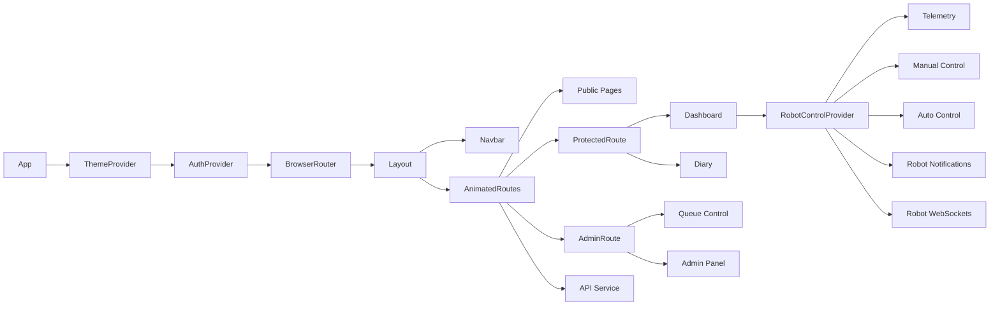

# Webseitenplanung TeleTable

## Idee
TeleTable ist eine Weboberflaeche fuer ein autonomes Transportsystem im Pflege- und Medical-Care-Umfeld. Die Website verbindet eine oeffentliche Projektpraesentation mit einem geschuetzten Bedienbereich fuer Live-Telemetrie, manuelle Robotersteuerung, autonome Routen, Warteschlange, Projekttagebuch und Administration.

Die Web-App ist Teil eines groesseren Systems:
- Frontend: React, Tailwind CSS, React Router, Contexts fuer Auth, Theme und Robot Control.
- Backend: Rust API mit Authentifizierung, Rollen, Diary, Robotik-Routen, WebSocket-Endpunkten und Benachrichtigungen.
- Firmware: Robotersteuerung mit Sensorik, Motoren, OLED, WLAN, WebSocket/HTTP-Anbindung.
- App: Flutter-Client mit aehnlichen Bedien- und Dashboard-Funktionen.

## Ziel
Die Website soll Nutzer schnell zum richtigen Bereich fuehren und gleichzeitig die Roboterbedienung sicher, uebersichtlich und robust machen. Im Vordergrund stehen:
- schnelle Orientierung fuer Besucher und angemeldete Nutzer,
- sichere Anmeldung mit rollenbasierter Freigabe,
- Live-Ueberwachung des Roboters,
- kontrollierte manuelle und autonome Steuerung,
- nachvollziehbare Dokumentation ueber das Projekttagebuch,
- Admin-Werkzeuge fuer Nutzer, Rollen, Sessions und Queue.

## Zielgruppe
- Oeffentliche Besucher: sehen Landing Page, About, Contact, rechtliche Seiten und Public Diary.
- Viewer: duerfen sich anmelden und den Roboterstatus live ansehen, aber keine Steuerbefehle senden.
- Operator: duerfen Routen auswaehlen und den Roboter manuell steuern.
- Admin: verwalten Nutzer, Rollen, Sessions, Queue, Peripherie und erweiterte Roboteraktionen.
- Projektteam und Betreuungspersonen: nutzen Diary und Dashboard zur Dokumentation, Kontrolle und Demonstration.

## Struktur
Die Website ist als Single Page Application mit React Router aufgebaut. Das globale Layout besteht aus fixer Navigation, Inhaltsbereich und Footer. Geschuetzte Seiten werden ueber `ProtectedRoute` und `AdminRoute` abgesichert.

### Sitemap
- `/` Landing
  - TeleTable als autonomes Transportsystem vorstellen.
  - Call-to-Action zu Login bzw. Dashboard.
  - Feature-Ueberblick: autonome Navigation, Live-Telemetrie, Energieversorgung.
- `/about`
  - Projekt- und Teamvorstellung.
- `/contact`
  - Kontaktmoeglichkeit.
- `/privacy`, `/terms`
  - Datenschutz und Nutzungsbedingungen.
- `/login`, `/register`
  - Authentifizierung und Registrierung.
- `/dashboard`
  - Geschuetzter Hauptbereich fuer Telemetrie, manuelle Steuerung, autonome Navigation, Benachrichtigungen.
- `/diary`
  - Geschuetztes Projekttagebuch mit Eintraegen, Diagramm, Erstellen, Bearbeiten und Loeschen.
- `/diary/public`
  - Oeffentliches, read-only Projekttagebuch.
- `/queue`
  - Admin-Seite fuer Routen-Warteschlange.
- `/admin`
  - Admin Panel fuer Nutzerverwaltung, Rollen, Session-Historie und Account-Aktionen.

### Rollen und Rechte
- Visitor
  - Zugriff auf Landing, About, Contact, Privacy, Terms und Public Diary.
- Viewer
  - Zugriff auf Dashboard im read-only Modus.
  - Sieht Telemetry Status und Robot Notifications.
  - Keine manuelle Steuerung, keine Routenauswahl, kein Diary-Editor.
- Operator
  - Zugriff auf Dashboard und Diary.
  - Darf Drive Lock anfordern, WebSocket fuer manuelle Steuerung verbinden und Routen per HTTP auswaehlen.
- Admin
  - Vollzugriff auf Dashboard, Diary, Queue und Admin Panel.
  - Darf Queue optimieren/loeschen, Nutzer bearbeiten, Rollen aendern und Admin-Tools wie Dozzle/Uptime Kuma erreichen.

## User Interface
Der visuelle Stil ist technisch, dunkel, klar und dashboard-orientiert. Tailwind-Klassen, Glasflaechen, feine Borders und Akzentfarben machen Statusbereiche unterscheidbar, ohne die Bedienoberflaeche zu ueberladen.

### Globale UI-Elemente
- Fixe Top-Navigation mit TeleTable-Logo, Hauptlinks, Theme Toggle, Login/Register oder User-Menue.
- Mobile Navigation als ausklappbares Menue mit grossen Touch-Zielen.
- Footer mit Copyright, Privacy, Terms und Contact.
- Page Transitions fuer weichere Routenwechsel.
- Light/Dark Theme ueber `ThemeContext`.
- Icons aus `lucide-react` fuer Navigation, Status, Aktionen und Steuerfunktionen.

### Landing Page
- Hero mit klarem Produktversprechen: autonomes Transportsystem fuer moderne Care Center.
- Primaerer CTA fuehrt je nach Auth-Status zu Login oder Dashboard.
- Feature-Karten fuer autonome Navigation, Echtzeit-Telemetrie und Smart Power.
- Logo und Akzentgrafik transportieren die Marke TeleTable.

### Dashboard
- Fuer Viewer: fokussierte Telemetrieansicht mit Robot Notifications.
- Fuer Operator/Admin: zweispaltiges Desktop-Layout mit Telemetrie und Auto Control links, Manual Control rechts.
- Manual Control:
  - WebSocket-Verbindungsstatus.
  - Drive Lock anfordern/freigeben.
  - Joystick fuer Touch/Pointer.
  - WASD-Unterstuetzung fuer Desktop.
  - Sofortiges Stoppen beim Loslassen, Fensterwechsel oder Verbindungsabbruch.
- Auto Control:
  - Start- und Zielauswahl aus Backend-Nodes.
  - Route per HTTP in die Queue legen.
  - Admin-only WebSocket-Navigation und Cancel.
- Admin-Aktionen im Dashboard:
  - Queue Control als Modal.
  - Peripherals Control als Modal fuer LED/Audio.

### Diary
- Geschuetztes Project Diary mit Eintragsliste, Balkendiagramm, Formular und Editiermodus.
- Public Diary ist read-only und oeffentlich erreichbar.
- Lade-, Fehler- und Leerzustaende sind sichtbar.

### Queue Control
- Tabelle der Routen mit Reihenfolge, Start/Ziel, Ersteller, Zeitpunkt und Aktionen.
- Auto-Refresh alle 5 Sekunden.
- Admin kann Routen loeschen und Queue optimieren.
- Eingebetteter Modus im Dashboard-Modal und eigenstaendige Admin-Seite.

### Admin Panel
- Nutzerliste mit Suche und Sortierung.
- Rollenmodell: Admin, Operator, Viewer.
- Nutzer bearbeiten und loeschen.
- Session-Historie pro Nutzer mit IP, Browser, Zeitpunkt und Raw-Fingerprint-Details.
- Modale Dialoge fuer Bearbeitung, Loeschbestaetigung und Session-Ansicht.

## Bedienbarkeit
- Navigation passt sich dem Login-Status und der Rolle an.
- Aktive Routen werden in der Navigation hervorgehoben.
- Buttons nutzen klare Icons, Statusfarben und Disabled-Zustaende.
- Kritische Aktionen wie Loeschen werden bestaetigt.
- Fehlermeldungen werden direkt im Kontext angezeigt.
- Success-Messages verschwinden nach kurzer Zeit automatisch.
- Live-Daten werden ueber WebSocket empfangen; Queue-Daten werden regelmaessig aktualisiert.
- Manual Control verhindert auf Touch-Geraeten Scrollen waehrend der Joystick-Bedienung.
- Bei Seitenwechsel, Tab-Wechsel oder Verlassen der Seite wird die manuelle Steuerung zurueckgesetzt bzw. der Lock geloest.
- Tabellen sind horizontal scrollbar, damit lange Inhalte auf kleineren Screens nicht das Layout sprengen.

## Responsive Design
Responsive Verhalten ist fest einzuplanen und im aktuellen Frontend bereits an vielen Stellen angelegt:
- Navigation:
  - Desktop ab `lg` mit horizontalen Links und User-Menue.
  - Mobile unter `lg` mit Hamburger-Menue, grossen Zeilen und scrollbarem Menuebereich.
- Layout:
  - Hauptcontainer nutzt responsive Padding (`px-4 sm:px-6 lg:px-8`) und obere Abstaende fuer die fixe Navigation.
  - Dashboard wechselt von gestapeltem Mobile-Layout zu `lg:grid lg:grid-cols-12`.
  - Manual Control erscheint mobil zuerst, damit Steuerung schnell erreichbar ist.
- Komponenten:
  - Telemetry-Karten wechseln von einer Spalte zu zwei bzw. drei Spalten.
  - Auto Control nutzt auf Mobile eine Spalte und ab `sm` zwei Spalten.
  - Admin- und Queue-Tabellen liegen in `overflow-x-auto`.
  - Modale Fenster begrenzen Hoehe und Breite (`max-h`, `max-w`) und bleiben scrollbar.
- Touch-Bedienung:
  - Joystick nutzt Pointer Events und `touch-none`.
  - Mobile Buttontexte werden gekuerzt, damit sie nicht umbrechen oder ueberlaufen.
- Ziel:
  - Die Website muss auf Smartphone, Tablet und Desktop bedienbar bleiben.
  - Robotersteuerung darf mobil nicht durch Browser-Scroll oder Pull-to-Refresh gestoert werden.

## Daten und Schnittstellen
- Auth:
  - `POST /login`, `POST /register`, `GET /me`.
  - Token wird lokal gespeichert und als Bearer Token gesendet.
  - Fingerprint-Daten werden beim Login/Register erfasst.
- Diary:
  - `GET /diary`, `GET /diary/all`, `DELETE /diary` und Formularaktionen fuer Eintraege.
- Robot Control:
  - WebSocket `/ws/drive/manual` fuer manuelle Befehle.
  - WebSocket `/ws/robot/events` fuer Status-Updates und Benachrichtigungen.
  - `POST /drive/lock`, `DELETE /drive/lock`.
  - `GET /nodes`, `POST /routes/select`, `GET /robot/check`.
- Queue:
  - `GET /routes`, `DELETE /routes/:id`, `POST /routes/optimize`.
- Admin:
  - `GET /users`, `POST /user`, `DELETE /user`.
  - `GET /user/:id/sessions` bzw. Fallback `GET /users/:id/sessions`.

## Datenobjekte
- User
  - `id`, `name`, `email`, `role`, `created_at`, `last_sign_on`.
- Session
  - `id`, `created_at`, `ip_address`, `user_agent`, `fingerprint_data`.
- DiaryEntry
  - `id`, `title`, `content`, `created_at`, oeffentlicher Status je nach Backend-Modell.
- RobotStatus
  - `systemHealth`, `batteryLevel`, `driveMode`, `cargoStatus`, `position`, `lastRoute`, `manualLockHolderName`, `robotConnected`, `nodes`.
- RobotNotification
  - `id`, `priority`, `message`, `receivedAt`.
- Route
  - `id`, `start`, `destination`, `added_by`, `added_at`.

## Nichtfunktionale Anforderungen
- Rollenbasierte Zugriffskontrolle fuer alle geschuetzten und administrativen Bereiche.
- Robuste Fehlerbehandlung fuer HTTP und WebSocket.
- Gute Lesbarkeit im Dark und Light Theme.
- Barrierearme Kontraste, erkennbare Fokus- und Hover-Zustaende.
- Kurze Ladezeiten durch schlanke React-Komponenten und gezielte API-Aufrufe.
- Keine Layoutspruenge bei Live-Daten, Ladezustaenden oder Modalen.
- Bedienbarkeit mit Maus, Tastatur und Touch.
- Vermeidung riskanter Dauerbefehle bei manueller Robotersteuerung.

## UML: Komponenten- und Datenflussmodell

## Meilensteine
1. Informationsarchitektur und Rollenmodell finalisieren.
2. Public Pages und Landing Page inhaltlich schaerfen.
3. Auth Flow mit Login, Register und Redirects pruefen.
4. Dashboard fuer Viewer, Operator und Admin testen.
5. Manual Control auf Desktop und Mobile verifizieren.
6. Diary und Public Diary mit realen Daten pruefen.
7. Queue Control und Admin Panel rollenbasiert absichern.
8. Responsive Tests fuer Smartphone, Tablet und Desktop durchfuehren.
9. Fehler-, Lade- und Offline-Zustaende polieren.
